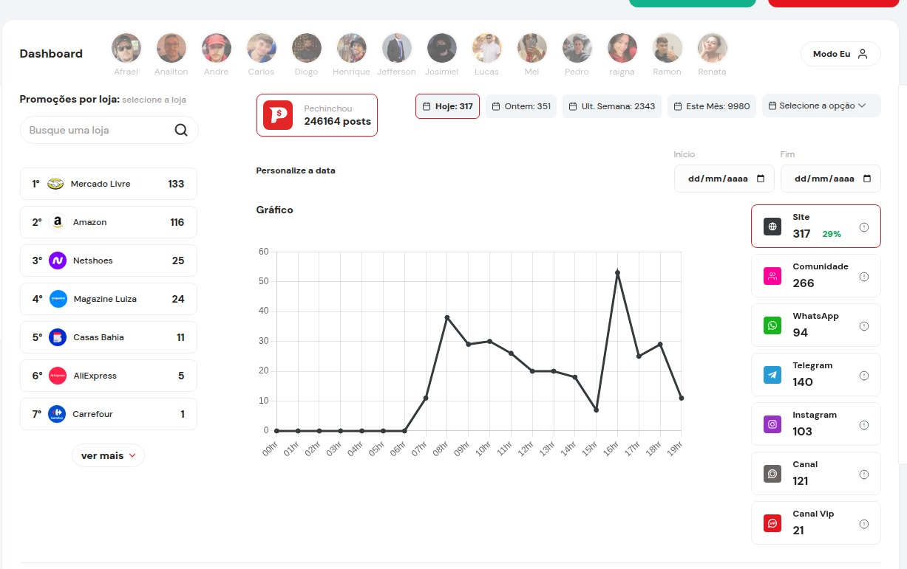

# 🧾 Dashboard de Promoções

Esta dashboard tem como objetivo medir a produtividade geral das promoções, além da produtividade individual de cada usuário/postador.

<figure><figcaption></figcaption></figure>

#### Visão geral

Na dashboard de produtividade de promoções, é possível acompanhar a quantidade de promoções postadas em diferentes períodos:

* Hoje
* Ontem
* Última semana
* Último mês
* Período personalizado

#### Produtividade por frente

Na barra lateral esquerda, é possível visualizar a quantidade de promoções por frente, incluindo:

* Site
* WhatsApp
* Instagram
* Canal
* Canal VIP
* Comunidade
* Telegram

#### Formas de contagem

A dashboard trabalha com duas formas principais de contabilização:

**1. Contagem por quem postou a promoção**

Aplicada às seguintes frentes:

* Site
* WhatsApp
* Instagram
* Canal
* Canal VIP

**2. Contagem por quem enviou a promoção**

Aplicada às seguintes frentes:

* Comunidade
* Telegram

Dessa forma, a análise diferencia quem realizou a postagem da promoção e quem fez o envio em determinada rede social.

#### Contagem por lojas

Na barra lateral direita, é possível visualizar a contagem de lojas, ordenadas da mais postada para a menos postada, de acordo com o período ou filtro selecionado.

Essa visualização pode considerar filtros como:

* Hora
* Dia
* Usuário
* Rede social
* Período personalizado

#### Ranking de usuários

A dashboard também apresenta um ranking com os usuários que mais se destacaram, considerando:

* Maior quantidade de promoções postadas
* Melhor desempenho em visualizações
* Maior número de envios pelo WhatsApp

#### Lista de promoções

Na parte inferior da dashboard, são exibidas as promoções postadas conforme os filtros aplicados.

É possível visualizar e analisar as promoções por:

* Usuário
* Dia
* Loja
* Rede social enviada ou postada

#### Resumo da estrutura da dashboard

#### Visão geral

Na dashboard de produtividade de promoções, é possível acompanhar a quantidade de promoções postadas em diferentes períodos:

* Hoje
* Ontem
* Última semana
* Último mês
* Período personalizado

#### Produtividade por frente

Na barra lateral esquerda, é possível visualizar a quantidade de promoções por frente, incluindo:

* Site
* WhatsApp
* Instagram
* Canal
* Canal VIP
* Comunidade
* Telegram

#### Formas de contagem

A dashboard trabalha com duas formas principais de contabilização:

**1. Contagem por quem postou a promoção**

Aplicada às seguintes frentes:

* Site
* WhatsApp
* Instagram
* Canal
* Canal VIP

**2. Contagem por quem enviou a promoção**

Aplicada às seguintes frentes:

* Comunidade
* Telegram

Dessa forma, a análise diferencia quem realizou a postagem da promoção e quem fez o envio em determinada rede social.

#### Contagem por lojas

Na barra lateral direita, é possível visualizar a contagem de lojas, ordenadas da mais postada para a menos postada, de acordo com o período ou filtro selecionado.

Essa visualização pode considerar filtros como:

* Hora
* Dia
* Usuário
* Rede social
* Período personalizado

#### Ranking de usuários

A dashboard também apresenta um ranking com os usuários que mais se destacaram, considerando:

* Maior quantidade de promoções postadas
* Melhor desempenho em visualizações
* Maior número de envios pelo WhatsApp

#### Lista de promoções

Na parte inferior da dashboard, são exibidas as promoções postadas conforme os filtros aplicados.

É possível visualizar e analisar as promoções por:

* Usuário
* Dia
* Loja
* Rede social enviada ou postada

#### Resumo da estrutura da dashboard

| Área da dashboard      | O que apresenta                             | Objetivo                                                              |
| ---------------------- | ------------------------------------------- | --------------------------------------------------------------------- |
| Visão geral            | Quantidade de promoções por período         | Acompanhar o volume de postagens em datas específicas                 |
| Barra lateral esquerda | Quantidade de promoções por frente          | Identificar a produtividade por canal ou rede social                  |
| Formas de contagem     | Contagem por quem postou e por quem enviou  | Diferenciar os tipos de participação dos usuários                     |
| Barra lateral direita  | Ranking de lojas mais postadas              | Visualizar quais lojas tiveram maior volume de promoções              |
| Ranking de usuários    | Usuários com mais postagens, views e envios | Medir desempenho individual dos participantes                         |
| Lista de promoções     | Promoções conforme filtros aplicados        | Consultar detalhes das promoções por usuário, dia, loja e rede social |

##
